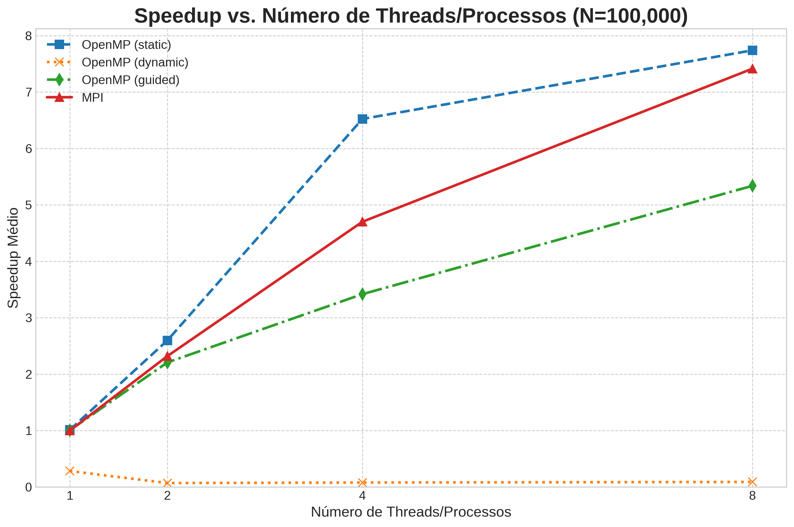

# Odd-Even Transposition Sort Paralelo com OpenMP e MPI

Este projeto, desenvolvido para a disciplina de Computação de Alto Desempenho da UFRJ, explora a paralelização do algoritmo de ordenação **Odd-Even Transposition Sort**. Foram implementadas e analisadas três versões:
1.  **Serial**: Uma implementação sequencial pura para servir como linha de base (baseline).
2.  **OpenMP**: Uma versão paralela utilizando o paradigma de memória compartilhada.
3.  **MPI**: Uma versão paralela utilizando o paradigma de troca de mensagens.

O objetivo é comparar o desempenho das versões paralelas em relação à serial, avaliando métricas como tempo de execução, *speedup*, eficiência e *overhead*.

## Estrutura do Projeto

```
/
├── build/                # Diretório para os executáveis (criado pelo Makefile)
├── data/                 # Arquivos CSV com os resultados dos experimentos
├── graficos/             # Gráficos gerados a partir dos dados coletados
├── scripts/              # Scripts para automação de testes e geração de gráficos
│   ├── run_experiments.sh
│   ├── calculate_averages.py
│   └── plot_graphs.py
├── tex/                  # Arquivos LaTeX do relatório final
├── .gitignore
├── Makefile              # Automatiza a compilação e os testes
├── odd_even_serial.c     # Código-fonte da versão Serial
├── odd_even_openmp.c     # Código-fonte da versão OpenMP
├── odd_even_mpi.c        # Código-fonte da versão MPI
├── utils.h               # Funções utilitárias (ex: is_sorted)
├── csv_utils.h           # Funções para manipulação de arquivos CSV
└── README.md             # Este arquivo
```

## Resultados

O gráfico abaixo resume o ganho de desempenho (*speedup*) das versões paralelas para uma entrada de 100.000 elementos. Ele mostra como cada abordagem escala com o aumento do número de threads (OpenMP) ou processos (MPI).



As principais conclusões visíveis no gráfico são:
- A versão **OpenMP com agendamento `static`** foi a mais eficiente, alcançando um speedup de aproximadamente 7.7x com 8 threads. Isso se deve à carga de trabalho perfeitamente balanceada do algoritmo.
- A versão **MPI** também demonstrou excelente escalabilidade, aproximando-se do desempenho do OpenMP com 8 processos.
- O agendamento **`dynamic` no OpenMP** se mostrou inadequado para este problema, resultando em um desempenho inferior ao da versão serial devido ao alto overhead de gerenciamento das threads.

## Pré-requisitos

Antes de começar, garanta que você tenha os seguintes softwares instalados:

*   **Compilador C**: `gcc`
*   **Implementação MPI**: `Open MPI` (que fornece `mpicc`)
*   **Utilitário Make**: `make`
*   **Python 3**: Para os scripts de análise.
*   **Bibliotecas Python**:
    ```bash
    pip install pandas matplotlib seaborn
    ```

## Como Compilar

O projeto utiliza um `Makefile` para simplificar o processo de compilação.

1.  **Compilar todos os programas**:
    Execute o comando a seguir na raiz do projeto. Ele criará o diretório `build/` e compilará as três versões do algoritmo.
    ```bash
    make all
    ```

2.  **Limpar os arquivos compilados**:
    Para remover o diretório `build/` e todos os executáveis, use:
    ```bash
    make clean
    ```

## Como Executar

### Execução Manual

Você pode executar cada versão individualmente após a compilação.

*   **Versão Serial**:
    ```bash
    ./build/odd_even_serial <tamanho_do_array>
    # Exemplo:
    ./build/odd_even_serial 10000
    ```

*   **Versão OpenMP**:
    ```bash
    ./build/odd_even_openmp <tamanho_do_array> <numero_de_threads>
    # Exemplo:
    ./build/odd_even_openmp 10000 4
    ```

*   **Versão MPI**:
    ```bash
    mpirun -np <numero_de_processos> ./build/odd_even_mpi <tamanho_do_array>
    # Exemplo:
    mpirun -np 4 ./build/odd_even_mpi 10000
    ```

### Fluxo Completo Automatizado

Para reproduzir todos os experimentos e gerar os resultados (dados e gráficos), siga os passos abaixo.

**Passo 1: Compilar os programas**
```bash
make all
```

**Passo 2: Executar todos os experimentos**
O script `run_experiments.sh` irá executar as três versões do programa com diferentes tamanhos de entrada e números de threads/processos. Os resultados brutos serão salvos em arquivos `.csv` no diretório `data/`.

```bash
bash scripts/run_experiments.sh
```

**Passo 3: Calcular as médias dos resultados**
O script `calculate_averages.py` lê os arquivos CSV brutos, calcula a média para cada conjunto de parâmetros e salva os resultados em novos arquivos `*_average.csv` no diretório `data/`.

```bash
python3 scripts/calculate_averages.py
```

**Passo 4: Gerar os gráficos**
Finalmente, o script `plot_graphs.py` utiliza os arquivos de médias para gerar todos os gráficos de análise de desempenho, salvando-os como imagens `.png` no diretório `graficos/`.

```bash
python3 scripts/plot_graphs.py
```

Após esses quatro passos, os diretórios `data/` e `graficos/` estarão populados com todos os resultados e visualizações, e o relatório completo em PDF pode ser encontrado em `tex/relatorio.pdf`.

## Link para o repositório

[https://github.com/rolim520/Odd-Even-Transposition-Sort-Paralelo](https://github.com/rolim520/Odd-Even-Transposition-Sort-Paralelo)
